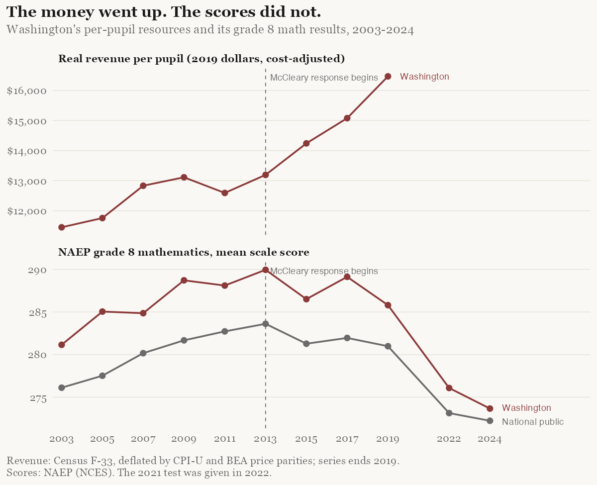
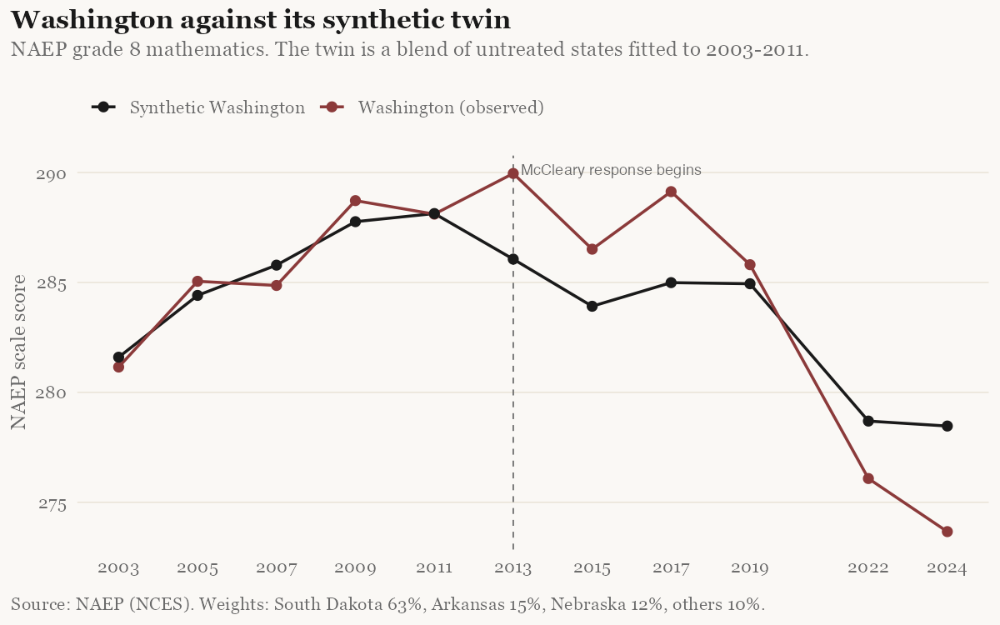

The Seattle Times has opened a series it calls [*Educating Washington*](https://www.seattletimes.com/education-lab/), promising to take up the perennial questions of the state's schools. Its first installment, by Education Lab reporter Dahlia Bazzaz, asks a lawyer's question: [*Is WA meeting its constitutional commitment to education?*](https://www.seattletimes.com/education-lab/is-wa-meeting-its-constitutional-commitment-to-education/) The commitment is the opening sentence of Article IX of the state constitution, which every Washington schoolchild is supposed to have heard at least once:

> It is the paramount duty of the state to make ample provision for the education of all children residing within its borders without distinction or preference on account of race, color, caste, or sex.

Bazzaz's answer runs, understandably, through money. In 2012 the state Supreme Court ruled in *McCleary v. Washington* that the Legislature was in breach of that sentence. When the Legislature dawdled, the court held it in contempt and fined the state $100,000 a day, a sanction that ran for three years and accumulated to about $105 million before lawmakers appropriated the money. K–12 is now the largest item in the state budget. It bought smaller classes, some of the highest teacher salaries in the country, and per-student spending a little above the national average. In June 2018 the court declared itself satisfied and released the Legislature from its supervision. On that reading, yes, the commitment has been met. The court said so.

The series promises a second installment on "what results the state gets, and doesn't get, for its substantial investment." That is the better question, and it is worth asking before the Times does. The framers of 1889 did not write "paramount duty" to secure a budget line. They wrote it to secure educated children. Whether the state is meeting its commitment is, in any sense a citizen should care about, a question about results. The money is supposed to serve the constitution's purpose, not substitute for it.

So here are the results, set beside the money, before any statistical machinery is applied.

<figure class="article-figure">

<figcaption>Washington's per-pupil resources, adjusted for inflation and for the cost of living, against its grade 8 mathematics results on the National Assessment of Educational Progress. The dashed line marks the first test after the McCleary ruling.</figcaption>
</figure>

Real, cost-adjusted revenue per student rose 31 per cent between the last test before the ruling and 2019. Over the same years Washington's grade 8 math score, on the one examination that is administered identically in every state, fell by two points, and the state's lead over the national average slipped from 5.4 points to 4.8. Then came the pandemic, which took every state down together.

Two lines on a chart are not an estimate, and a fair-minded reader should resist drawing a conclusion from them. But before turning them into something more rigorous, it is worth being precise about what the court actually decided, because a good deal of the public argument assumes it decided something it did not.

## What the court held

The Supreme Court gets to say what the constitution means, and nothing here disputes that. But the popular memory of *McCleary* is that the justices found Washington's children were being shortchanged and ordered the state to fix it. The opinion is narrower than that, in a way that matters for how the money should now be judged.

**The court defined the duty by inputs, not outcomes.** The 2012 opinion rests on a 1978 case, *Seattle School District v. State*, which read "ample" to mean "liberal, unrestrained, without parsimony, fully, sufficient," and read "education" as broad opportunity: preparing children to "compete adequately in our open political system, in the labor market, or in the market place of ideas." *McCleary* affirmed a trial judge's gloss that ample means "considerably more than just adequate," and then stated its holding in a single sentence:

> The "education" required under article IX, section 1 consists of the opportunity to obtain the knowledge and skills described in *Seattle School District*, ESHB 1209, and the EALRs. It does not reflect a right to a guaranteed educational outcome.

The justices went further, acknowledging "the inescapable truth that certain factors critical to a student's achievement are simply outside the State's control." Anyone who suspects that *McCleary* rests on a theory that every child starts equal and only money separates them can put the suspicion down. The court expressly declined to make results the standard. Its holding is about opportunity, and opportunity, in the court's reckoning, is measured by what the state provides.

**The finding of underfunding was an accounting finding.** The Legislature had already written its own definition of a "program of basic education." The trial record showed the state's allocation formulas paid districts less than that program actually cost: utilities funded at $115 per student against $252 spent, instructional salaries about $8,000 below what districts paid, and so on down the ledger. Districts filled the gap with local levies. The court's reasoning was that "full funding is whatever the Legislature says it is" amounts to "little more than a tautology," and that levies, being subject to local votes and local property wealth, are not the "regular and dependable" revenue the constitution demands. That is the whole violation. The state was not paying the cost of the program it had itself defined, and was relying on an impermissible source to cover the difference.

**Equity enters only through the levy analysis.** The constitutional phrase about race, color, caste, and sex is recited in the opinion and never applied. The court's equity concern was between districts: a property-rich district raises more per levy dollar than a property-poor one. There is no analysis of racial or economic achievement gaps, and no test score or graduation rate appears anywhere in the part of the opinion that finds the violation. The achievement statistics that do appear are quoted from legislative reports, as background.

**Compliance was judged the same way.** From the 2014 contempt finding through the daily fine to the order that closed the case, the court "measured progress specifically according to the areas of basic education identified" in the Legislature's own reform bills: transportation, materials and operating costs, all-day kindergarten, class sizes in the early grades, and salaries. When it released the Legislature in June 2018, it did so because the state "has now complied with this court's orders to fully implement the State's new program of basic education," while noting in the same paragraph that the plaintiffs "still dispute the constitutional adequacy of the funding formulas." No outcome measure appears in any of the seven orders. The court was candid about the limits of what it had done: it "has not purported to take over public education."

So the Times's question has a legal answer and a substantive one. The legal answer is yes, as of 2018, because the court defined the commitment as funding a statutory program and the program got funded. The substantive answer, the one the framers would have cared about and the one the court explicitly left to the Legislature and the public, is whether the children are better educated.

## Compared to what?

The difficulty with answering that is the pandemic, and more generally the difficulty with any before-and-after comparison. Washington's scores fell after 2019. So did everyone's. Comparing Washington in 2024 with Washington in 2011 would credit McCleary with a virus. The honest counterfactual is not "Washington before the money." It is "Washington had the Legislature never responded to the court at all," and that Washington does not exist.

Economists have a standard tool for conjuring it, called a synthetic control. Rather than pick one comparison state, which invites the accusation that you picked it to get the answer you wanted, the method builds a weighted blend of many states, with the weights chosen by a fixed rule: find the mix whose combined scores most closely reproduced Washington's own path in the years *before* the ruling. The weights cannot be negative and must sum to one, so the synthetic twin is always an average of real states and never an extrapolation. Once the weights are fixed on the pre-2013 data, the same blend is carried forward, and the gap between the real Washington and its twin is the estimated effect of whatever happened to Washington and not to the others.

A study published this month applies exactly that design to Washington's grade 8 mathematics scores, using every state's results from 2003 through 2024, excluding ten states that had school-finance upheavals of their own during the period. The twin the optimizer produced is mostly South Dakota, with smaller helpings of Arkansas and Nebraska.

<figure class="article-figure">

<figcaption>The twin tracks Washington closely before the ruling. Afterward, Washington drifts a few points above it, then below. The question is whether that drift is larger than the method produces by chance.</figcaption>
</figure>

Two results come out of it, and they point in opposite directions.

**The money is real.** The same method, applied to per-pupil revenue instead of test scores, finds that by 2019 Washington was spending about $3,000 more per student than its synthetic twin, in dollars adjusted for both inflation and the Puget Sound cost of living. The familiar objection that McCleary was merely a levy swap, shuffling the same dollars from local to state ledgers, does not survive the arithmetic. Real resources per child rose substantially relative to what would otherwise have happened.

**The achievement gain is absent.** Washington's math scores diverge from the twin by an average of about three scale points across the post-ruling years. That sounds like something until you learn what the method produces when nothing has happened. Run the same procedure pretending each untreated state was the one that got a court order in 2013, and the typical state diverges from *its* twin by three points too. Washington's divergence ranks 33rd of 40. A sustained effect would have needed to be about five and a half points, roughly the size of Washington's entire lead over the nation, to stand out from that noise. It did not.

The study is careful to say what this does and does not establish. A modest effect of a point or two cannot be ruled out, and with a biennial test and only five pre-ruling observations, never could have been. But an effect of the size McCleary's advocates argued for, one that would have visibly moved Washington's standing against the country, is not in the data. And there is no positive result anywhere for a defender of the spending to point at.

## The right way to look at it

None of this says money does not matter in schools. The best evidence that it does comes from reforms that sent it to poor districts, and McCleary's money went nearly everywhere at once, with a levy cap that partly redistributed *away* from the districts that had been taxing themselves hardest. A null for McCleary is consistent with targeted finance reform working elsewhere. Nor does it touch the two places where the Times finds Washington genuinely weak, preschool enrollment and college completion, neither of which the constitutional clause reaches.

But it does bear on how to read the clause. Whether Washington is meeting its constitutional commitment depends on what you take the commitment to be. If it is the one the court enforced, a funded statutory program, the state met it in 2018 and the matter is closed. If it is the one the authors of Article IX plainly had in mind, educated children, then the best comparable measure we possess says the largest school-funding increase in the state's history has not yet produced evidence of it. The court was honest enough to say that outcomes were never its yardstick. The rest of us should be honest enough to make them ours.

<aside class="article-sources">

Sources

The synthetic-control study, with its data pipeline and specification checks, is public at <a href="https://github.com/richardsprague/wa-education-roi">github.com/richardsprague/wa-education-roi</a>. The Seattle Times series, <em>Educating Washington</em>, opens with Dahlia Bazzaz, "Is WA meeting its constitutional commitment to education?" (Sept. 20, 2026). The <em>McCleary</em> opinion (173 Wn.2d 477) and the court's orders through June 7, 2018 are on the Washington courts' website; <em>Seattle School District No. 1 v. State</em> is 90 Wn.2d 476 (1978).

</aside>
